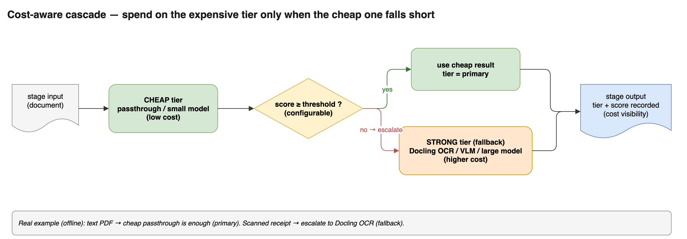

# prismdoc

**Cost-aware, schema-driven document extraction pipeline — deployable as a microservice.**


prismdoc is an **orchestration layer** on top of existing extraction engines (OCR, layout, LLM/VLM).
It turns messy documents — invoices, receipts, spec sheets, catalogs — into **clean, validated,
structured records**, while spending money on expensive models **only when the cheap path isn't good
enough**.

It is *not* another OCR/parsing engine. It plugs the good ones in (Docling, PyMuPDF, litellm-backed
LLMs) and gives you the pipeline around them: routing, cost control, schema validation, a figure
sub-pipeline, and three ways to run it (library, CLI, microservice).


---

## Why prismdoc

- **Cost-aware by design.** A cheap tier runs first; prismdoc escalates to a stronger, pricier tier
  **only when a configurable quality threshold isn't met** — and records which tier ran, so cost is visible.
- **Schema-driven output.** You declare the fields you want; you get back validated JSON, not raw markdown.
- **Figures handled separately.** Images/diagrams are pulled out, replaced with a placeholder, processed
  by a different method (OCR/VLM), then **merged back** into the structure at the placeholder location.
- **Pluggable & declarative.** Every step is a `Stage` resolved from a registry; whole pipelines are
  declared in YAML. Swap an engine without touching code.
- **Runs three ways.** Python library, `prismdoc` CLI, or a FastAPI + Docker microservice.

## Key features

| Feature | What it does |
|---|---|
| **Cost-aware cascade** | Cheap primary → score → fall back to a stronger tier below a threshold |
| **Schema-driven extraction** | `TargetSchema` → LLM (via litellm) → validated `Record`s |
| **Figure sub-pipeline** | Extract images → `[[FIGURE:id]]` placeholder → process → merge back |
| **Ingest** | PDF (PyMuPDF), images (Pillow), spreadsheets (openpyxl) |
| **Parse** | Passthrough (offline) or Docling OCR (optional) |
| **Validate + Normalize** | Required-field checks, type coercion, whitespace/dedup cleanup |
| **Graceful errors** | Encrypted/corrupt documents fail with a clear typed error |
| **Serving** | FastAPI `POST /extract` + `GET /health`, Dockerfile + compose |

---

## Install

```bash
python -m venv .venv && source .venv/bin/activate
pip install -e .                 # core
pip install -e ".[dev]"          # + tests/lint
pip install -e ".[docling]"      # + OCR fallback (Docling/RapidOCR)
pip install -e ".[llm]"          # + LLM extraction (litellm; Bedrock/OpenAI/local)
pip install -e ".[api]"          # + FastAPI serving
```

## Quickstart (fully offline, no API key)

Structured extraction on a retail spreadsheet, end to end:

```bash
python examples/retail/make_sample.py
python -m prismdoc.cli \
  --config examples/retail/demo.yaml \
  --input examples/retail/sample_catalog.xlsx \
  --csv out.csv
```

```
records: 5   |   validation: valid=5 invalid=0 errors=0
name                   | sku      | price | currency | unit   | brand       | category
-----------------------+----------+-------+----------+--------+-------------+----------
Arabica Coffee Beans   | SKU-1001 | 12.5  | USD      | kg     | Acme        | Beverages
...
```

---

## The cost-aware cascade



Run the cheap tier, score the result, and escalate **only** if it's below your threshold. The decision
and score are recorded on the document (`artifacts["router"]`) so you can see where money was spent.

Declared in YAML:

```yaml
pipeline:
  - ingest.default
  - cascade:
      primary:  parse.passthrough   # cheap, free
      fallback: parse.docling       # stronger, costs compute
      scorer:   text_length
      threshold: 20
  - extract.table
  - validate.default
  - normalize.default
```

Real behaviour (offline, from `examples/retail/pipeline_cascade.yaml`):

| Input | Cheap tier score | Decision |
|---|---|---|
| Text invoice (PDF) | 2074 | `tier=primary` — passthrough is enough, **no OCR spent** |
| Scanned receipt (JPG) | 9 | `tier=fallback` — escalates to **Docling OCR** |

The same pattern applies to extraction (cheap model → strong model) via injectable LLM clients.

## Figure / diagram sub-pipeline

Documents with embedded images/diagrams are handled on a side path:

```
parse markdown:  "...text... [[FIGURE:fig_0_0]] ...text..."
                              │
   figures extracted ─────────┘   process (OCR / VLM / stub)   ──► merge result back
                                                                    into the placeholder
```

Declared via `figures.extract → figures.process → figures.merge` (see
`examples/retail/pipeline_figures.yaml`). The processor is pluggable — the default is an offline stub;
an OCR/VLM processor slots in without changing the round-trip.

## Structured extraction with an LLM

The `extract.default` stage is schema-driven and provider-agnostic via
[litellm](https://github.com/BerriAI/litellm). The LLM client is injectable, so the pipeline is fully
testable offline with a mock; a live run needs `pip install prismdoc[llm]` and provider credentials.

```yaml
schema:
  fields:
    - {name: name, type: string, required: true}
    - {name: price, type: number}
pipeline:
  - ingest.default
  - parse.default
  - extract.default: {model: "bedrock/anthropic.claude-3-5-sonnet-20240620-v1:0"}
  - validate.default
  - normalize.default
```

Set credentials via your provider's usual env vars (e.g. AWS creds/region for Bedrock, `OPENAI_API_KEY`
for OpenAI).

## Run as a service

```bash
pip install -e ".[api,llm]"
uvicorn prismdoc.api.app:app --port 8000
# or:
docker compose up --build
```

```bash
curl -F "file=@invoice.pdf" http://localhost:8000/extract
curl http://localhost:8000/health
```

---

## Project layout

```
src/prismdoc/
  models.py        # Document, Page, Block, Record, TraceEntry (Pydantic)
  schema.py        # FieldSpec, TargetSchema
  pipeline.py      # sequential runner + trace
  registry.py      # plugin registry
  config.py        # load_pipeline / build_pipeline (YAML)
  cli.py           # `prismdoc` CLI
  stages/
    ingest.py      # PDF / image / xlsx loaders
    parse.py       # passthrough + Docling OCR
    cascade.py     # cost-aware cascade + scorers
    figures.py     # figure extract / process / merge
    extract.py     # schema-driven LLM extraction (litellm)
    validate.py    # schema validation + coercion
    normalize.py   # cleanup + dedup
    table_extract.py  # offline spreadsheet extractor
  api/app.py       # FastAPI service
examples/retail/   # sample generator + demo pipelines
docs/              # PRD, tech spec, diagrams
```

## Development

```bash
pip install -e ".[dev]"
pytest            # 76 passing
ruff check src tests
```

## Roadmap

- [x] Core pipeline, ingest/parse/extract/validate/normalize
- [x] YAML config, CLI, FastAPI + Docker
- [x] Cost-aware cascade (threshold + fallback)
- [x] Figure/diagram sub-pipeline
- [ ] Eval harness (per-field accuracy vs ground truth)
- [ ] Review dashboard / human-in-the-loop
- [ ] Managed/hosted API (open-core)

## License

MIT — see [LICENSE](LICENSE).
