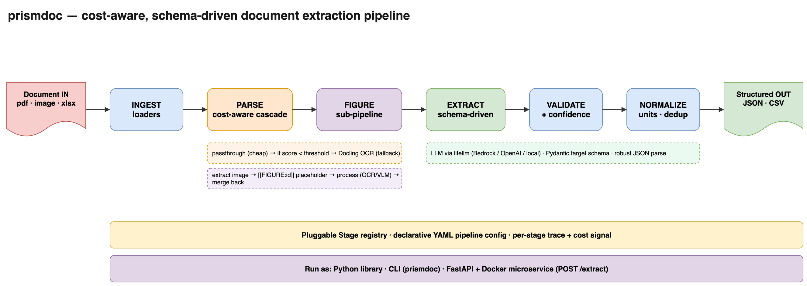
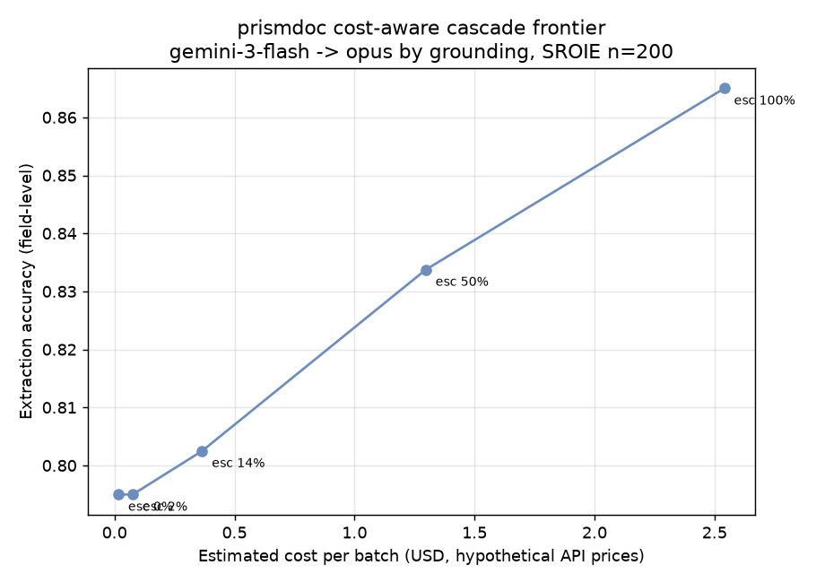
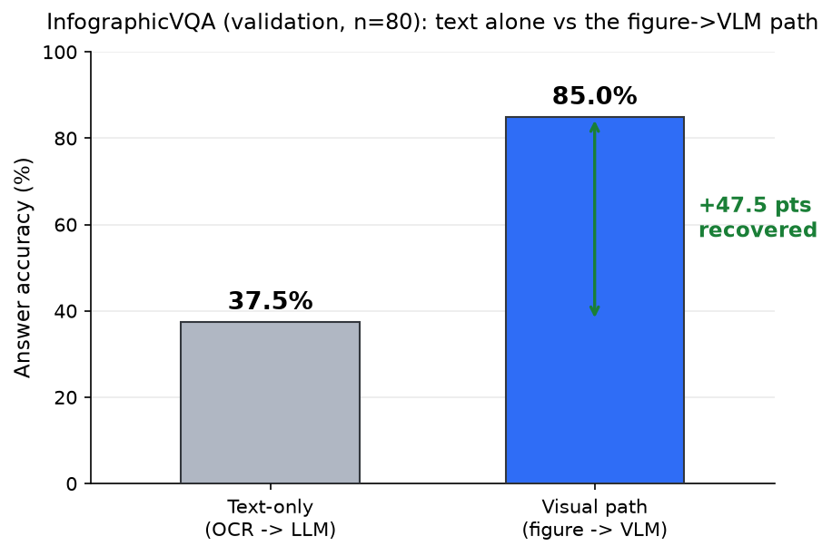
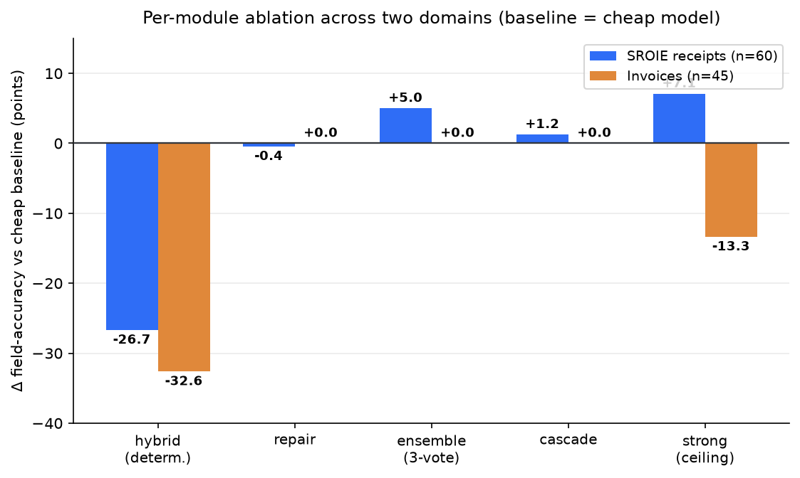

# prismdoc

**A cost-aware, schema-driven document-intelligence pipeline — deployable as a microservice.**


[](https://github.com/gnutvz/prismdoc/actions/workflows/ci.yml)


prismdoc is an **orchestration layer** on top of existing extraction engines (OCR, layout, LLM/VLM).
It turns messy documents — invoices, receipts, spec sheets, catalogs — into **clean, validated,
structured records**, while spending money on expensive models **only when the cheap path isn't good
enough**. The same pipeline handles flat records, visual/figure content, and mixed-modality documents today, with tabular and hierarchical archetypes on the roadmap.

It is *not* another OCR/parsing engine. It plugs the good ones in (Docling, PyMuPDF, litellm-backed
LLMs) and gives you the pipeline around them: routing, cost control, schema validation, a figure
sub-pipeline, and three ways to run it (library, CLI, microservice).



## What prismdoc competes on

The extraction **engines** — OCR, table extraction, VLMs — are commodities: prismdoc **integrates** the
best ones and lets you swap them. The value (and the moat) is the orchestration and quality layer around
them:

- **Routing** — cost-aware cascade (escalate only the hard cases) + archetype-based strategy selection.
- **Normalization** — schema coercion, locale-aware numbers, cleanup/dedup into validated records.
- **Verification** — did the value come from the *right place*? label/column checks, not just presence.
- **Provenance** — evidence-first lineage: the model cites the source span, we locate it (never fabricate).
- **Evaluation** — measured on public ground truth, honest ablation, null results published.

Plug in your own OCR / table / VLM engine; prismdoc adds the routing, quality, and auditability layer that
turns a raw extractor into a trustworthy pipeline. This is real, not a slogan: the **parser is a swappable
provider** — the same `parse → verify → repair → normalize` pipeline runs on **Docling** or **pdfplumber**
by changing one config line (`parse.docling` → `parse.pdfplumber`); a cloud provider is added by
implementing the one-method `Parser` interface. Every seam — parser, model, verifier, rule, scorer,
loader — is documented in **[docs/EXTENDING.md](docs/EXTENDING.md)**.

> **How this repo is built — measure everything, publish the negatives.** Every claim here is measured on
> **public data with ground truth**, and the docs report what *didn't* work as loudly as what did: a module
> that actively *hurts* accuracy ([ablation](docs/ABLATION.md)), a verifier that 100% false-alarmed before a
> fix, and an error class that turned out to be rare in practice ([verification](docs/VERIFICATION.md)). If
> you review one file to judge the engineering, read **[docs/VERIFICATION.md](docs/VERIFICATION.md)** — a
> full measure → find the flaw → fix → re-measure investigation, null results included.

## Why prismdoc

- **Cost-aware by design.** A cheap tier runs first; prismdoc escalates to a stronger, pricier tier
  **only when a configurable quality threshold isn't met** — and records which tier ran, so cost is visible.
- **Schema-driven output.** You declare the fields you want; you get back validated JSON, not raw markdown.
- **Figures handled separately.** Images/diagrams are pulled out, replaced with a placeholder, processed
  by a different method (OCR/VLM), then **merged back** into the structure at the placeholder location.
- **Pluggable & declarative.** Every step is a `Stage` resolved from a registry; whole pipelines are
  declared in YAML. Swap an engine without touching code.
- **Runs three ways.** Python library, `prismdoc` CLI, or a FastAPI + Docker microservice.

## Document archetypes

Every document is one — or a mix — of a few **archetypes**, and each wants a different sub-pipeline.
prismdoc is built around that abstraction rather than around one document type: invoices and receipts
are simply the first, best-benchmarked archetype. The engine (stage registry + YAML pipelines) is
archetype-agnostic — adding an archetype is composing stages, not forking the framework.

| Archetype | Example documents | Sub-pipeline | Status |
|---|---|---|---|
| **Flat** | invoice, receipt, form | parse → extract → validate | ✅ **Proven** — SROIE + invoice benchmarks, cost-aware cascade |
| **Visual** | chart, diagram, infographic | OCR + figure→VLM → merge | ✅ **Proven** — +49-pt figure→VLM gain (InfographicVQA, n=200) |
| **Mixed** | report / paper with text + figures | route text→text, figure→VLM, merge | ✅ **Case study** — composed pipeline recovers figure-only data |
| **Tabular** | bank statement, catalog, line-items | parse → (table detect) → row extract → merge | 🟡 **Partial** — chunk→extract→merge works; a dedicated table detector/extractor is roadmap |
| **Hierarchical** | contract, SOP, manual | chunk → section graph → cross-reference | ⬜ **Roadmap** — needs section / reference modeling beyond chunk-and-merge |

Invoices/receipts remain the anchor because they have public ground truth (SROIE, CORD) and are easy to
reproduce — proving *the framework works* before proving *breadth*.

---

## Proof it works

Two claims, both measured on **public datasets with real ground truth** — not synthetic self-tests.
Full methodology, numbers, and caveats in **[docs/BENCHMARK.md](docs/BENCHMARK.md)**.

### 1. The cost-aware cascade captures most of the accuracy for a fraction of the cost

A cheap model (`gemini-3-flash`) runs first; only the hard, low-grounding cases escalate to a strong
model (`claude-opus`), on public scanned receipts (**SROIE**).



- The cheap model **alone** already gets most of the way, at near-zero cost.
- Sending **everything** to the strong model adds only a few accuracy points — at **~150× the cost**.
- The cascade buys the intermediate points: escalate just the shakiest cases and capture most of the
  gain for a fraction of the spend. That gap is the money the routing saves.

### 2. On mixed-modality documents, the figure→VLM path recovers what text alone can't

On a document that mixes text with charts and diagrams, text-only extraction is blind to figures and
whole-page VLM is costly/inconsistent. prismdoc **routes**: text→text, each figure→VLM, then merges the
result back at the placeholder.

Measured on **InfographicVQA** (validation, 200 distinct infographics with ground truth): answering from
the **OCR text alone scores 35.5%**, but the **figure→VLM path scores 84.5%** — a **+49.0-point** gap
(stable at +47.5 to +49.0 across n=40, 80, and 200) that only the visual route recovers.



See **[docs/mixed-modality.md](docs/mixed-modality.md)** for the benchmark (reproduce with
`python -m prismdoc.bench.infovqa`) and a real case study — a paper whose embedded infographic holds data
(`Canada Post 53,000, UPS 12,000…`) that text-only drops and the composed pipeline recovers.

Also benchmarked in [docs/BENCHMARK.md](docs/BENCHMARK.md): OCR-recall of the parse layer, end-to-end
extraction accuracy across four model providers (Claude / GPT / Gemini / Grok), and confidence
calibration. Numbers are honestly caveated (sample size, estimated prices, heuristic escalation signal).

### 3. Which modules actually earn their keep — a per-module ablation

We ablated five modules on **two domains** (receipts + invoices, real ground truth) against a
cheap-model baseline. The result is deliberately unvarnished: cascade and ensemble help where there is
headroom, repair is roughly neutral, the naïve deterministic tier **hurts** — and a bigger model is not
always better. Full table and reasoning in **[docs/ABLATION.md](docs/ABLATION.md)**.



---

## Key features

| Feature | What it does |
|---|---|
| **Cost-aware cascade** | Cheap primary → score → fall back to a stronger tier below a threshold |
| **Schema-driven extraction** | `TargetSchema` → LLM (via litellm) → validated `Record`s |
| **Figure sub-pipeline** | Extract images → `[[FIGURE:id]]` placeholder → process → merge back |
| **Ingest** | PDF (PyMuPDF), images (Pillow), spreadsheets (openpyxl) |
| **Parse** | Swappable engine by config: Passthrough (offline), Docling OCR, or pdfplumber — add a cloud provider (Textract / Azure DI / Google Doc AI) by implementing the `Parser` interface |
| **Validate + Normalize** | Required-field checks, type coercion, whitespace/dedup cleanup |
| **Confidence per field** | Per-field confidence + low-confidence flags in the output |
| **Cost ledger** | Real per-stage token/USD accounting + optional per-request budget |
| **Eval + benchmarks** | Per-field accuracy vs ground truth; public SROIE + InfographicVQA benchmarks |
| **LLM resilience** | Timeout + retry/backoff around the model call |
| **Graceful errors** | Encrypted/corrupt documents fail with a clear typed error |
| **Serving** | FastAPI `POST /extract` + `GET /health`, Dockerfile + compose |

---

## Scope: a focused microservice, not a platform

prismdoc does **one thing well — the document-extraction workflow** — and stays a **stateless,
embeddable microservice**. It deliberately does **not** bake in platform concerns, so you can drop it
into your own infrastructure without fighting its opinions.

| prismdoc owns (in this repo) | You own (at deploy time) |
|---|---|
| Ingest → cascade parse/OCR → figures → extract → validate → normalize | Scaling: queue, worker pool, autoscaling (put it behind your own) |
| Cost-aware routing + per-request cost ledger | Persistence: job store, artifact store (S3/DB) |
| Per-field confidence + low-confidence flags | Caching/idempotency (recommended: key by document content-hash at your gateway) |
| Schema-driven extraction + validation | Multi-tenancy, quotas, auth |
| Eval harness, LLM retry/timeout | Review UI / human-in-the-loop, dashboards, OTel wiring |

This boundary is the point: no lock-in, easy to self-host (the offline path needs no API key), and it
composes with whatever queue/store/observability stack you already run.

---

## Get started

As a library:

```bash
pip install prismdoc            # + extras: prismdoc[docling], [llm], [api]
```

Or clone and run the fully-offline demo (no API key needed) in three lines:

```bash
pip install -e .
python examples/retail/make_sample.py
python -m prismdoc.cli --config examples/retail/demo.yaml \
  --input examples/retail/sample_catalog.xlsx --csv out.csv
```

Full setup, YAML configuration, running as a service, and the dev/eval/benchmark commands are in
**[docs/GETTING_STARTED.md](docs/GETTING_STARTED.md)**.

---

## Known limitations (honest)

- **Benchmarks are preliminary.** SROIE cascade numbers are n≈158 with estimated cost; the
  InfographicVQA gap uses a relaxed match (not official ANLS). A per-module **ablation** across two
  domains ([docs/ABLATION.md](docs/ABLATION.md)) is now done and is deliberately honest: cascade and
  ensemble help (where there is headroom), repair is ~neutral, and the naïve deterministic **hybrid tier
  actively hurts** (−27 to −33 points) — use it only with anchored regex, not the generic matchers.
- **Provenance is evidence-first, with a value-search fallback.** With `ExtractStage(evidence=True)` the
  model cites the exact source span for each field; `ProvenanceStage` locates *that* span
  (word-boundary aware), so a value like `10.00` that appears as subtotal / tax / total resolves to the
  right line — and a hallucinated span is rejected (fall back, never fabricated). Without cited evidence
  it reverse-locates the value (best-effort, first match). It is still not native OCR-token → field
  lineage (no per-token bbox IDs).
- **Confidence calibration is dataset-specific.** The measured map is for *these* receipts + OCR + model
  + prompt + schema. Re-measure for your own document type / engine / model.
- **Deterministic ≠ correct.** The hybrid regex tier is deterministic and free, but a regex can be
  consistently wrong — validate its fields like any other.
- **Long-document & ensemble are basic.** Chunking is chunk→extract→merge/dedup (no chunk overlap, no
  cross-page entity linking; a single line longer than the limit becomes an over-limit chunk). Ensemble
  is per-field majority vote **over the first record of each model** — no multi-record alignment (fine
  for a header record, not for aligning N line items across models). Neither is benchmarked on hard cases yet.
- **Figures need a real processor wired in.** The default `FigureProcessor` is an offline stub; the
  measured +49-point figure→VLM result used a VLM plugged into that seam (see
  [docs/mixed-modality.md](docs/mixed-modality.md)). The benchmark proves the *routing thesis* — text
  alone misses figure data — not that the shipped default extracts it.

## Roadmap

<details>
<summary><strong>Done in v0.3.0–v0.4.0</strong> — foundation, reliability & auditability (click to expand)</summary>

v0.3.0:

- [x] Core pipeline, ingest/parse/extract/validate/normalize
- [x] YAML config, CLI, FastAPI + Docker
- [x] Cost-aware cascade (threshold + fallback)
- [x] Figure/diagram sub-pipeline
- [x] Eval harness (type-aware per-field accuracy vs ground truth)
- [x] Threshold-sweep accuracy/USD frontier (`prismdoc-sweep`)
- [x] Cost ledger (per-stage token/USD accounting + budget)
- [x] Per-field confidence + low-confidence flags (grounding-based)
- [x] LLM resilience (timeout + retry/backoff)
- [x] Public SROIE benchmark: OCR-recall, multi-model extraction, cost/accuracy frontier

v0.4.0 — reliability & auditability:

- [x] Confidence calibration map (measured on SROIE; `ConfidenceStage(calibration=...)`)
- [x] Business-rule / cross-field validation (`subtotal + tax = total`, in-set, range…)
- [x] Field provenance (page / bbox / source text per field)
- [x] Adaptive field retry (re-prompt only the failed fields)
- [x] Composite cascade scorer (char-validity + coverage + grounding, not just length)
- [x] Observability signals (per-stage latency, escalation/violation rates, tokens, cost)
- [x] Long-document chunking (chunk → extract → merge/dedup)
- [x] Model ensemble + disagreement flags

</details>

Done (v0.5.0) — evidence, benchmarks & honest ablation:

- [x] Evidence-first provenance (model-cited source spans → field lineage; `ExtractStage(evidence=True)`)
- [x] Mixed-modality benchmark (InfographicVQA: figure→VLM path, +49.0 pts over text-only, n=200)
- [x] Per-module ablation across two domains (receipts + invoices) — [docs/ABLATION.md](docs/ABLATION.md)
- [x] Repair stale-artifact fix + rules `cannot_evaluate` vs `violation` split

Done (v0.5.1):

- [x] Merge per-chunk / per-model cost ledgers back into the parent document (chunked + ensemble now
  roll every sub-call up into `doc.artifacts["cost"]` and enforce the budget across sub-calls)

Done (v0.6.0) — semantic verification (right value vs. right place):

- [x] Label/region + table-**column** verification (`verify.label` / `verify.column`) — catches a value
  read from the wrong column (net-as-total): gross verifies 12/12, net flagged 10/12, 0 false alarms
- [x] Verification-driven **repair** (mismatch + hint) — fixes 10/10 of caught net-as-total errors
- [x] Verification-driven **confidence** (mismatch caps to 0.2 + flags) — 0/12 false flags on correct
- [x] Locale-aware numeric grounding (`8,25`, `57 483,07`, `1.767,34`)
- [x] Repositioned around document archetypes (flat/visual/mixed proven; tabular partial; hierarchical roadmap)

Next (still in-scope for a focused workflow service):

- [ ] **Tabular archetype** — a table detector/extractor + a public table benchmark (e.g. FinTabNet / bank statements)
- [ ] **Hierarchical archetype** — section graph + cross-reference resolution for contracts / SOPs
- [ ] More parser/extractor engines behind the existing interfaces
- [ ] Scale the benchmark further + per-provider cost/accuracy frontier
- [ ] Token-level provenance (per-token bbox IDs, beyond the current evidence-span lineage)

Out of scope by design — see [Scope](#scope-a-focused-microservice-not-a-platform); these belong to
whoever deploys prismdoc: async job queues, persistence/resume, multi-tenancy, review dashboards,
metrics/OTel infrastructure.

## License

MIT — see [LICENSE](LICENSE).
