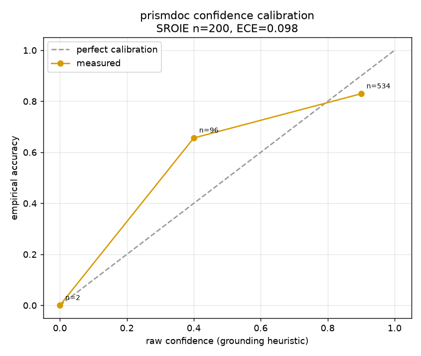

# Benchmark — SROIE OCR-recall

Offline quality signal for the **parse / OCR layer**, using public scanned receipts
from **SROIE** (ICDAR 2019 Scanned Receipts OCR and Information Extraction).

## What OCR-recall measures

Given a receipt image and ground-truth entity values (`company`, `date`, `address`,
`total`, …), OCR-recall asks:

> After Ingest + Parse, does the OCR / markdown text **contain** each ground-truth
> value?

This needs **no LLM and no API credentials** — only the optional `docling` extra for
real OCR at run time.

### Two metrics

| Metric | What it checks | When to use |
|--------|----------------|-------------|
| **exact** | Normalized substring match (case / whitespace; numeric totals are decimal-tolerant, e.g. `12.5` ↔ `12.50`) | Strict readout. Under-reports long multi-line fields (`address`, `company`) when OCR is near-complete but not verbatim. |
| **token** | Token-overlap recall: fraction of the field’s significant tokens (length > 2, split on whitespace/punctuation) that appear in the OCR text | Fair readout for multi-token fields. **Primary** metric for comparing OCR quality. |

Token-overlap is reported **only for multi-token fields** (at least 2 significant tokens). Short/atomic fields such as `date` and `total` show `—` for token and should be read via **exact**. When token is measurable, the invariant is **token ≥ exact**; a reported token below exact would indicate a metrics bug, not an OCR finding.

Exact match alone can show `address` recall near 0.0 even when most address tokens are present in the OCR text. Token-overlap is the primary table column for that reason; exact remains available as a strict diagnostic.

## What this does **not** measure

OCR-recall is **not** end-to-end extraction accuracy. A model may still fail to map
OCR text into schema fields even when every value is present in the text.

Treat OCR-recall as an **upper bound** on what extraction can get right: if the value
is missing from OCR text, no extractor can recover it without hallucination. Measuring
true extraction quality (model vs ground truth) is the next step after this harness.

## Dataset: SROIE

SROIE provides scanned receipt images plus entity annotations (company, date, address,
total). Obtain the public release from the ICDAR 2019 SROIE competition materials
(or a mirror such as the community GitHub / Kaggle mirrors of the same files).

You need, for each receipt:

- the image file, and
- the four entity string values.

## Build a manifest

The harness is **dataset-format-agnostic**. Point it at a JSON **manifest**: a list of
objects with relative image paths and field ground truth.

```json
[
  {
    "image": "images/X51005200938.jpg",
    "fields": {
      "company": "BOOK TA .K (TAMAN DAYA) SDN BHD",
      "date": "25/12/2018",
      "address": "NO.53 55,57 & 59, JALAN SAGU 18...",
      "total": "9.00"
    }
  }
]
```

Image paths are resolved relative to the manifest file's directory. Any labeled
receipt set can use the same shape.

## Run

```bash
pip install 'prismdoc[docling]'
prismdoc-bench --manifest path/to/sroie_manifest.json
# or
python -m prismdoc.bench.sroie --manifest path/to/sroie_manifest.json --limit 50
```

Output is a per-field table (`field | exact | token`) plus overall exact and overall
token means across samples. Prefer **token** as the primary readout.

## Results

Real run — **20 SROIE receipts**, Docling (RapidOCR / PP-OCRv4, CPU), 2026-07-17.

| Field   | exact | token |
|---------|-------|-------|
| company | 0.40  | 0.84  |
| date    | 0.95  | —     |
| address | 0.00  | 0.75  |
| total   | 0.95  | —     |

`date` and `total` show `—` for token: they are short/atomic (< 2 significant tokens), so token-overlap
is not measurable — read them via **exact**. (n = 20, preliminary; expect roughly ±0.2 at this size.)

### How to read this (metric depends on field shape)

A single "overall" number is misleading here because it averages across field types — use the metric
that fits each field:

| Field   | Right metric | Recall | Read |
|---------|--------------|--------|------|
| date    | exact | **0.95** | short/atomic → verbatim match is fair (token not measurable → `—`) |
| total   | exact | **0.95** | short number → verbatim match is fair (token not measurable → `—`) |
| company | token | **0.84** | multi-token → OCR captures most of it, not verbatim |
| address | token | **0.75** | long multi-line → exact reads 0.00 but OCR has ~3/4 of the tokens |

**Takeaway:** on real scanned receipts, Docling OCR recovers the key fields well — ~95% for atomic
fields (date, total) and ~75–84% token-recall for long fields (company, address). The remaining work
is *extraction*: mapping this OCR text into exact schema values (where the LLM + grounding confidence +
eval come in). This is the parse-layer upper bound.

## Extraction accuracy (end-to-end, multi-model)

Full pipeline — SROIE image → Docling OCR → LLM extract → compare vs ground truth (type-aware
`values_match`; string comparison is **alphanumeric-only**, so formatting/spacing differences don't
cause false failures). Model backends run via **CLI subscriptions, no API cost**: Claude Max
(`claude -p`) and Cursor Pro (`cursor-agent -p`). `tok/doc` is a cost proxy (the CLI returns no usage,
so cost is unmetered).

Preliminary — **n = 5 receipts** (expect ±0.2 at this size), sorted by overall:

| Model          | company | date | address | total | overall | tok/doc |
|----------------|---------|------|---------|-------|---------|---------|
| gemini-3-flash | 0.80    | 1.00 | 0.40    | 1.00  | **0.80**| 535     |
| grok-4.5       | 0.80    | 1.00 | 0.40    | 1.00  | **0.80**| 515     |
| claude-sonnet  | 0.40    | 1.00 | 0.20    | 1.00  | 0.65    | 522     |
| gpt-5.3-codex  | 0.60    | 0.60 | 0.20    | 1.00  | 0.60    | 518     |

Reading:

- **date, total: extracted ~perfectly** across models (gpt-5.3-codex's 0.60 date is n=5 noise / a
  date-format difference).
- **company: 0.40–0.80** now that formatting is not penalized (was ~0.00 before the alphanumeric
  string fix — a metric artifact, since e.g. pred `BOOK TAK(TAMAN DAYA)SDN BHD` vs GT
  `BOOK TA .K (TAMAN DAYA) SDN BHD` is the same content).
- **address: 0.20–0.40** — the remaining misses are GENUINE content differences (e.g. a street number
  read differently), not formatting; honest.
- At n = 5 the spread is within noise, but **gemini-3-flash and grok-4.5 lead directionally**;
  token/doc (~520) is comparable across models.

**Caveat:** n = 5 is tiny — directional only. A credible benchmark needs **n = 50+** and a
**threshold sweep for the accuracy-vs-USD frontier** (now feasible with the free CLI backends).

## Cost-aware cascade frontier

The point of the whole project: run a cheap model, and **escalate only the hard cases to a strong,
expensive model**. Here the cascade is `gemini-3-flash → claude-opus`, escalating a receipt when the
cheap model's output is poorly **grounded** in the OCR text (a proxy for "the cheap answer is shaky").

**Measured, not simulated.** These numbers come from running the **actual `CascadeStage`** end-to-end
(the cheap/strong model outputs are replayed from cache, but the real cascade code decides escalation,
selects the result, and records cost). Cross-checking the real run against an in-memory simulation on
the same 158 receipts: **accuracy matched exactly**, and doing this **caught a real bug** — escalated
documents were undercounting cost by the cheap tier (the cost ledger dropped the primary's spend on
escalation). Fixed in v0.4.0.

**n = 158 SROIE receipts.** Cost is **estimated** (hypothetical API prices — the CLI backends are
actually free via Claude Max / Cursor Pro): gemini-flash ≈ $0.10/$0.40 per 1M in/out,
opus ≈ $15/$75 per 1M.


| Escalation threshold | % escalated | accuracy | est. cost / batch |
|----------------------|-------------|----------|-------------------|
| 0.00 (cheap only)    | 0%          | 0.801    | $0.013            |
| 0.26                 | 2%          | 0.801    | $0.049            |
| 0.51                 | 12%         | 0.809    | $0.265            |
| 0.76                 | 47%         | 0.843    | $0.970            |
| 1.01 (strong only)   | 100%        | **0.872**| $1.978            |

**Reading the frontier:**

- The cheap model alone (gemini-3-flash) already reaches **80.1%** at near-zero cost.
- Sending **everything** to opus reaches **87.2%** — **+7 points** — but costs **~154×** more.
- Grounding-based escalation is a real Pareto curve: accuracy rises monotonically as you escalate more.
  Escalating just the **12%** lowest-grounding receipts buys the first easy gain; reaching the top costs
  the most (47% escalation → 84.3% at $0.97; 100% → 87.2% at $1.98). That gap is exactly the money the
  cost-aware cascade lets you *not* spend — pick the threshold that fits your accuracy/cost budget
  instead of paying for the strong model on every document.

**Caveats:** n = 158 (preliminary, ±0.05); costs are estimated at reference API prices; grounding
is a heuristic escalation signal. Per-feature ablation (does each module actually lift accuracy?) is
the next benchmark. Reproduce with `prismdoc.eval.sweep` on a cascade config once a hosted model is wired.

## Confidence calibration

The per-field confidence is a **heuristic** (grounded → 0.9, ungrounded → 0.4, missing → 0.0). Is it
calibrated — i.e. are the `0.9` fields actually right ~90% of the time? Measured on the same 200
receipts (632 field predictions from the cheap model, correctness by `values_match` vs ground truth):



| raw confidence | label | n | **empirical accuracy** |
|----------------|-------|---|------------------------|
| 0.90 | grounded | 534 | **0.830** |
| 0.40 | ungrounded | 96 | **0.656** |
| 0.00 | missing | 2 | 0.000 |

**Expected Calibration Error ≈ 0.098.** Two honest findings:

- **`0.9` (grounded) is right ~83%, not 90%** — slightly over-confident.
- **`0.4` (ungrounded) is right ~66%, not 40%** — the heuristic is far too *pessimistic* here. A value
  that isn't found verbatim in the OCR text is often still correct (the model reformats / normalizes a
  value that is semantically present). "Ungrounded" ≠ "wrong".

So the raw heuristic should not be read as a probability. The measured **calibration map** for this
dataset is `{0.0: 0.00, 0.4: 0.66, 0.9: 0.83}` — apply it (via `ConfidenceStage(calibration=...)`) to
turn the heuristic into calibrated confidence. Calibration is **dataset-specific**: measure it on your
own labeled sample rather than hardcoding these numbers.

## Mixed-modality: text-only vs the figure→VLM path

The cascade and OCR-recall sections above measure the **text** path. This section measures what the
**figure→VLM** path adds on documents whose answers live inside images — the reason prismdoc routes
figures out to a VLM and merges them back.

**Dataset:** InfographicVQA (validation split, real ground-truth answers), 200 distinct infographics
streamed from the Hugging Face datasets-server (no full download, no RRC registration). Each item's own
Amazon Textract OCR is used for the text-only baseline, so text-only sees *all* the text — just not the
layout.

**Two paths, same questions:**

- **Text-only** — infographic OCR text → LLM → answer.
- **Visual** — infographic image → VLM → answer (prismdoc's `figures.process`).


| Path | Accuracy (n=200) |
|------|------------------|
| Text-only (OCR → LLM) | **35.5%** (71/200) |
| Visual (figure → VLM) | **84.5%** (169/200) |
| **Gap recovered by the figure→VLM path** | **+49.0 points** |

The gap stayed within **+47.5 to +49.0 pts across n=40, 80, and 200** — stable, not a small-sample fluke.
Even with the full OCR text in hand, text-only answers barely a third of infographic questions; the
answers depend on chart values and spatial layout that raw text drops.

**Reproduce:** `python -m prismdoc.bench.infovqa --n 200 --out /tmp/infovqa` (source:
`src/prismdoc/bench/infovqa.py`).

**Honest scope:** scoring is a **relaxed** normalized match (gold-in-prediction), not official ANLS — a
coarse readout of the gap, not a leaderboard number. A single infographic is one image, so this isolates
the **figure→VLM contribution**; the full route-and-merge on a multi-figure document is shown
qualitatively in [mixed-modality.md](mixed-modality.md).

## Per-module ablation (two domains)

Does each module actually lift accuracy — across document types? We ablated five modules (hybrid, repair,
ensemble, cascade, strong-model) on **SROIE receipts (n=60)** and **invoices (n=45)** against a
cheap-model baseline, plus a rules-as-detector sub-study. The honest result: effects are domain-dependent,
the naïve deterministic tier hurts, and a bigger model is not always better.


Full methodology, per-field breakdown, the rules-detection study, and honest caveats are in
**[ABLATION.md](ABLATION.md)**.
